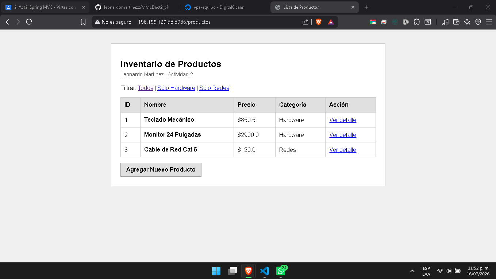
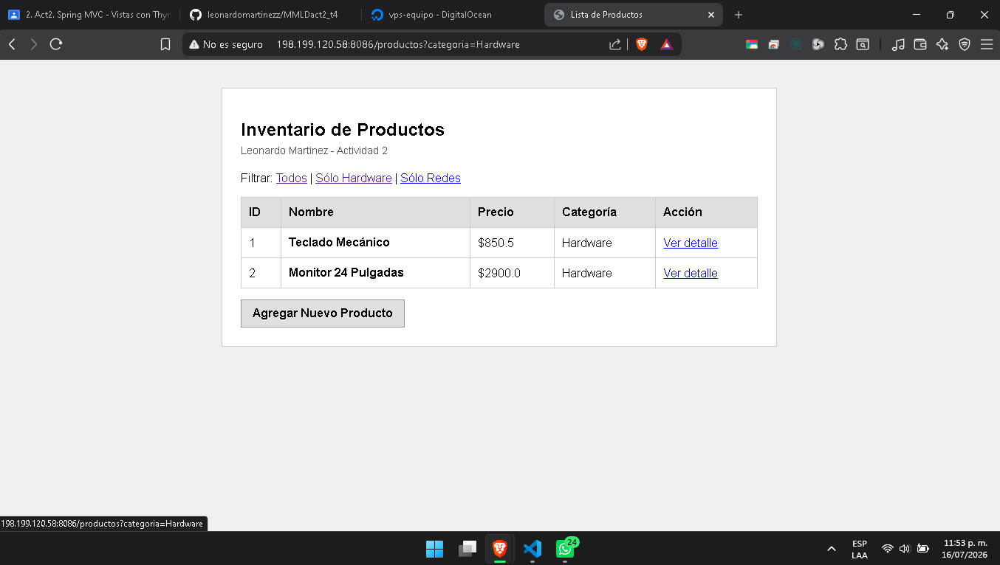
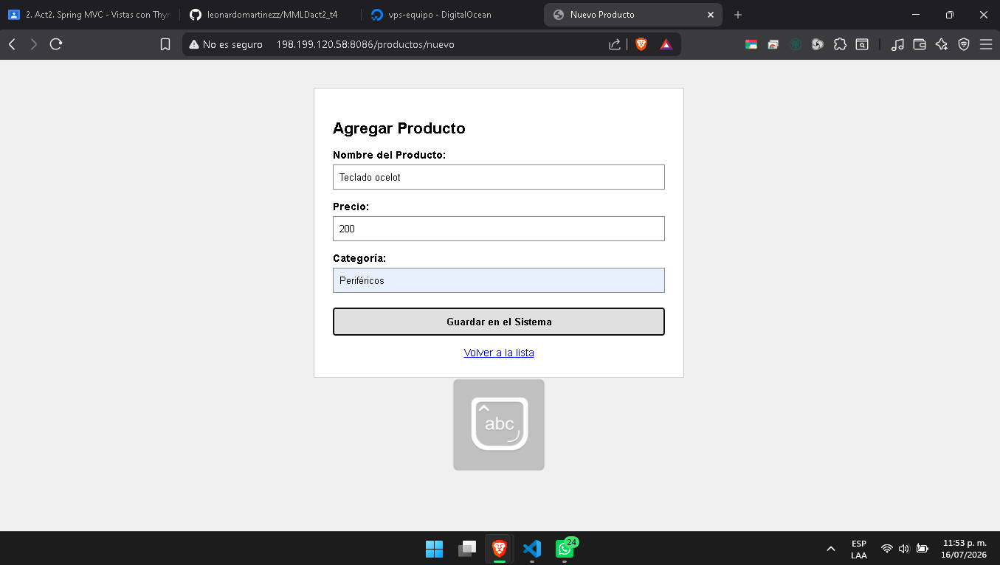
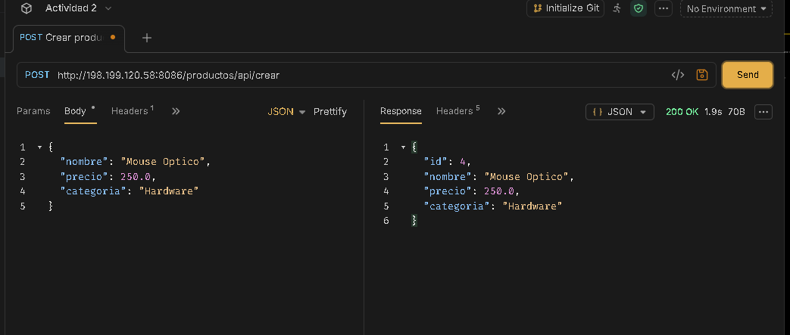
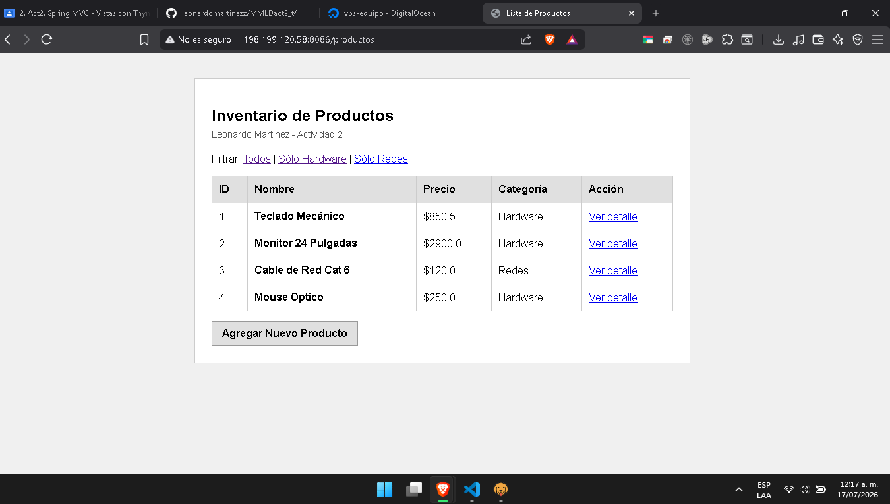

# Actividad 2: Spring Boot MVC y Thymeleaf

**Alumno:** Leonardo Martinez  
**Despliegue en VPS (Puerto 8086):** [http://198.199.120.58:8086/productos](http://198.199.120.58:8086/productos)

---

## Descripción del Proyecto
Este proyecto implementa el patrón de arquitectura **Model-View-Controller (MVC)** utilizando **Spring Boot 4.1.0** y **Thymeleaf** como motor de plantillas para el renderizado del lado del servidor. 

Se gestiona un inventario de productos tecnológicos mediante rutas limpias, buenas prácticas de transferencia de datos con objetos **DTO** y endpoints preparados tanto para vistas HTML tradicionales como para consumo REST en formato JSON.

---

## Arquitectura y Componentes (MVC)

* **Modelo (Model):** 
  * Se implementó la clase `ProductoDTO.java` como Objeto de Transferencia de Datos, utilizando tipos envolventes (`Integer`) para permitir el manejo correcto de identificadores nulos en nuevas creaciones.
  * Se utiliza el objeto `Model` de Spring para inyectar listas y datos estáticos desde el backend hacia la interfaz web.
* **Vista (View):** 
  * Plantillas HTML ubicadas en `src/main/resources/templates/` (`lista.html`, `formulario.html`, `detalle.html`).
  * Diseñadas con una interfaz plana, limpia y sin dependencias externas, utilizando directivas de Thymeleaf como `th:each`, `th:text`, `th:href` y `th:object`.
* **Controlador (Controller):** 
  * Clase `ProductoController.java` encargada de gestionar las peticiones HTTP, aplicar filtros de búsqueda por categoría y redirigir el flujo de navegación.

---

## Endpoints Principales

| Método | Ruta | Descripción | Anotación Clave |
| :--- | :--- | :--- | :--- |
| **GET** | `/productos` | Muestra el inventario completo y permite filtrar por categoría mediante parámetros de consulta (`?categoria=...`). | `@RequestParam` |
| **GET** | `/productos/{id}` | Muestra la vista de detalle de un producto específico según su identificador en la URL. | `@PathVariable` |
| **GET** | `/productos/nuevo` | Despliega el formulario web para el registro de un nuevo producto. | `Model.addAttribute` |
| **POST** | `/productos/guardar` | Recibe los datos enviados desde el formulario HTML y redirige a la lista principal. | `@ModelAttribute` |
| **POST** | `/productos/api/crear` | Endpoint REST que consume y produce formato JSON para integraciones externas (Postman / Bruno). | `@RequestBody` / `@ResponseBody` |

---

---

## Evidencias de Funcionamiento (Despliegue en Puerto 8086)

### 1. Pantalla de Inicio (Vista general del inventario con `th:each`)

### 2. Filtro de Categoría (Uso de `@RequestParam` para "Sólo Hardware")

### 3. Formulario de Registro (Uso de `@ModelAttribute` para agregar productos)

### 4. Configuración de Petición en Bruno (Envío de JSON a `@RequestBody`)

### 5. Resultado y Respuesta de Bruno (Estatus 200 OK y asignación de ID con `@ResponseBody`)
